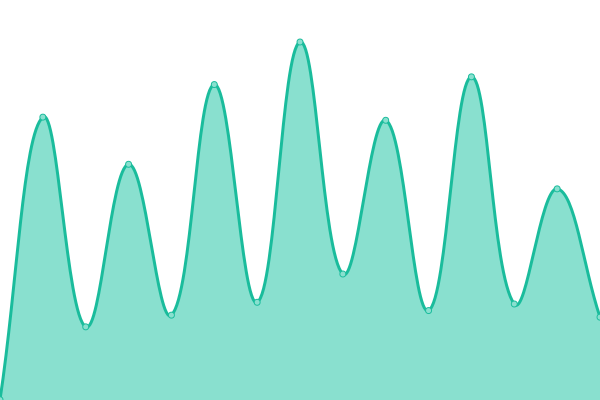

# [📈 Live Status](https://demo.upptime.js.org): <!--live status--> **🟧 Partial outage**

This repository contains the open-source uptime monitor and status page for [chris9091](https://demo.upptime.js.org), powered by [Upptime](https://github.com/upptime/upptime).

With [Upptime](https://upptime.js.org), you can get your own unlimited and free uptime monitor and status page, powered entirely by a GitHub repository. We use [Issues](https://github.com/chris9091/Monitor/issues) as incident reports, [Actions](https://github.com/chris9091/Monitor/actions) as uptime monitors, and [Pages](https://demo.upptime.js.org) for the status page.

<!--start: status pages-->
<!-- This summary is generated by Upptime (https://github.com/upptime/upptime) -->
<!-- Do not edit this manually, your changes will be overwritten -->
<!-- prettier-ignore -->
| URL | Status | History | Response Time | Uptime |
| --- | ------ | ------- | ------------- | ------ |
|  [Fleksa](https://fleksa.com) | 🟩 Up | [fleksa.yml](https://github.com/chris9091/Monitor/commits/HEAD/history/fleksa.yml) | 

 762ms
     
 | 

<a href="https://chris9091.github.io/Monitor/history/fleksa">98.56%</a>
    

|  [Good Taste](https://goodtaste.fleksa.de) | 🟩 Up | [good-taste.yml](https://github.com/chris9091/Monitor/commits/HEAD/history/good-taste.yml) | 

 611ms
     
 | 

<a href="https://chris9091.github.io/Monitor/history/good-taste">100.00%</a>
    

|  [My.fleksa](https://my.fleksa.com) | 🟩 Up | [my-fleksa.yml](https://github.com/chris9091/Monitor/commits/HEAD/history/my-fleksa.yml) | 

 577ms
     
 | 

<a href="https://chris9091.github.io/Monitor/history/my-fleksa">98.49%</a>
    

|  [Good Taste](https://goodtaste.fleksa.de/) | 🟩 Up | [good-taste.yml](https://github.com/chris9091/Monitor/commits/HEAD/history/good-taste.yml) | 

 611ms
     
 | 

<a href="https://chris9091.github.io/Monitor/history/good-taste">100.00%</a>
    

|  [Cheesy Burger](https://cheesyburger-walsrode.de/) | 🟩 Up | [cheesy-burger.yml](https://github.com/chris9091/Monitor/commits/HEAD/history/cheesy-burger.yml) | 

 752ms
     
 | 

<a href="https://chris9091.github.io/Monitor/history/cheesy-burger">100.00%</a>
    

|  [Pizzeria AMO](https://amopizzeria.de) | 🟩 Up | [pizzeria-amo.yml](https://github.com/chris9091/Monitor/commits/HEAD/history/pizzeria-amo.yml) | 

 781ms
     
 | 

<a href="https://chris9091.github.io/Monitor/history/pizzeria-amo">100.00%</a>
    

|  [Berlin aaoji](https://berlin-aaoji.de) | 🟥 Down | [berlin-aaoji.yml](https://github.com/chris9091/Monitor/commits/HEAD/history/berlin-aaoji.yml) | 

 0ms
     
 | 

<a href="https://chris9091.github.io/Monitor/history/berlin-aaoji">0.00%</a>
    

|  [Gandhi pizza](http://gandhipizzaservice.de) | 🟥 Down | [gandhi-pizza.yml](https://github.com/chris9091/Monitor/commits/HEAD/history/gandhi-pizza.yml) | 

 0ms
     
 | 

<a href="https://chris9091.github.io/Monitor/history/gandhi-pizza">0.00%</a>
    

|  [Indian Flavour](http://indianflavour.de) | 🟥 Down | [indian-flavour.yml](https://github.com/chris9091/Monitor/commits/HEAD/history/indian-flavour.yml) | 

 674ms
     
 | 

<a href="https://chris9091.github.io/Monitor/history/indian-flavour">57.75%</a>
    

|  [NIDDA API](https://my.fleksa.com/pyapi/shop/restaurant-nidda.de/index) | 🟩 Up | [nidda-api.yml](https://github.com/chris9091/Monitor/commits/HEAD/history/nidda-api.yml) | 

 525ms
     
 | 

<a href="https://chris9091.github.io/Monitor/history/nidda-api">100.00%</a>
    

|  [Eatarian](https://eatarian.com) | 🟩 Up | [eatarian.yml](https://github.com/chris9091/Monitor/commits/HEAD/history/eatarian.yml) | 

 827ms
     
 | 

<a href="https://chris9091.github.io/Monitor/history/eatarian">100.00%</a>
    

|  [Deli tadka](https://www.delitadka.de/) | 🟩 Up | [deli-tadka.yml](https://github.com/chris9091/Monitor/commits/HEAD/history/deli-tadka.yml) | 

 1459ms
     
 | 

<a href="https://chris9091.github.io/Monitor/history/deli-tadka">100.00%</a>
    

|  [Kiranekidukaan](https://www.kiranekidukaan.de/) | 🟥 Down | [kiranekidukaan.yml](https://github.com/chris9091/Monitor/commits/HEAD/history/kiranekidukaan.yml) | 

 0ms
     
 | 

<a href="https://chris9091.github.io/Monitor/history/kiranekidukaan">0.02%</a>
    

|  [Kirana store](https://kirana-store.de/admin/sessions/login) | 🟩 Up | [kirana-store.yml](https://github.com/chris9091/Monitor/commits/HEAD/history/kirana-store.yml) | 

 956ms
     
 | 

<a href="https://chris9091.github.io/Monitor/history/kirana-store">100.00%</a>
    

|  [Fleksa monitor test](https://chris9091.github.io/Fleksa_monitor01/) | 🟩 Up | [fleksa-monitor-test.yml](https://github.com/chris9091/Monitor/commits/HEAD/history/fleksa-monitor-test.yml) | 

 107ms
     
 | 

<a href="https://chris9091.github.io/Monitor/history/fleksa-monitor-test">5.88%</a>
    

<!--end: status pages-->

[**Visit our status website →**](https://demo.upptime.js.org)

## 📄 License

- Powered by: [Upptime](https://github.com/upptime/upptime)
- Code: [MIT](./LICENSE) © [chris9091](https://demo.upptime.js.org)
- Data in the `./history` directory: [Open Database License](https://opendatacommons.org/licenses/odbl/1-0/)
